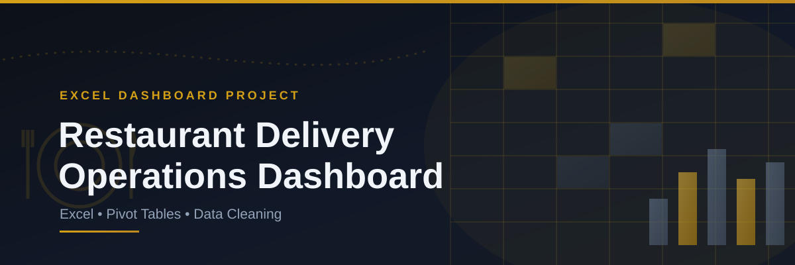

# Restaurant-Food-Delivery-Operations-Excel

# 🍽️ Restaurant Food Delivery Operations Dashboard | Excel

An end-to-end Excel dashboard analyzing **160 food delivery orders** across **5 city branches** to track revenue, delivery performance, and customer ratings for a restaurant delivery operation.

---

## 📌 Project Overview

This project takes raw, messy order data and turns it into a fully interactive Excel dashboard for operations tracking. It covers:

- Data cleaning and standardization (fixing cuisine names, customer names, and delivery status)
- Building master lookup tables for branches and menu items
- Creating pivot tables to summarize revenue, delivery speed, and ratings
- A final interactive dashboard with slicers for real-time filtering

The workbook follows a complete Excel analytics pipeline: **Raw Data → Cleaned Data → Pivot Tables → Dashboard.**

---

## 🛠️ Tools & Technologies

| Stage | Tool |
|---|---|
| Data cleaning & standardization | Excel (formulas, data validation) |
| Lookup/reference tables | Excel Master Tables (Branch, Menu Item) |
| Summarization | Pivot Tables |
| Visualization | Excel Dashboard with Slicers |

---

## 📂 Repository Contents

| File | Description |
|---|---|
| `Excel Project_Restaurant Food Delivery Operations Dashboard.xlsx` | Full workbook — raw data, cleaned data, pivot tables, and dashboard |
| `Dashboard live.mp4` | Screen recording of the interactive dashboard in action |

---

## 📊 Dataset

The workbook is structured across multiple sheets:

- **Raw_Data** — original, unprocessed order records (Order ID, date, time, branch, cuisine, item, customer, order value, delivery time, rating, payment mode)
- **Master_Branch** — branch code, branch name, city, and manager reference table
- **Master_Menu Item** — menu item, cuisine, price, and category reference table
- **Clean_Data** — standardized data with corrected cuisine names, clean customer names, mapped city, order day/month, delivery status, and rating category
- **Summary** — aggregated revenue by branch and by cuisine
- **Pivot Tables** — pivot summaries powering the dashboard visuals
- **Dashboard** — final interactive report with slicers for branch, city, cuisine, and payment mode

---

## 🔍 Analysis Approach

1. **Data cleaning** — corrected inconsistent cuisine labels and customer names, mapped branch codes to cities, and derived delivery status (Fast/Normal/Slow) and rating category (Good/Needs Improvement).
2. **Branch & city performance** — aggregated total revenue per branch and per city to identify top-performing locations.
3. **Cuisine performance** — compared revenue contribution across five cuisine types.
4. **Delivery efficiency** — calculated average delivery time overall and by city to flag slow-performing branches.
5. **Customer experience** — analyzed rating distribution and payment mode preference across orders.

---

## 📈 Dashboard

The final Excel dashboard brings all the analysis together into one interactive view, including:

- KPI cards for total revenue, average order value, and average delivery time
- Revenue breakdown by branch and by cuisine
- Delivery status distribution (Fast / Normal / Slow)
- Rating category breakdown (Good / Needs Improvement)
- Payment mode split (Cash / UPI / Credit-Debit Card)
- Interactive slicers to filter by branch, city, cuisine, and payment mode

🎥 Live demo: [`Dashboard live.mp4`](Dashboard%20live.mp4)

---

## 💡 Key Insights

- Total revenue across all branches: **₹31,505** from 160 orders, at an average order value of **₹197**.
- **Bengaluru (Koramangala)** is the top-performing branch by revenue (₹10,505), more than double the lowest branch, Vijayawada (₹4,143).
- **North Indian** cuisine drives the most revenue (₹7,462), narrowly ahead of Fast Food (₹7,333).
- Average delivery time across all orders is **25.4 minutes**; **Hyderabad** is the slowest branch (29.8 min avg) while **Kochi** is the fastest (21.9 min avg).
- **45% of orders (72 of 160)** were delivered "Fast," but **14% (23 orders)** were flagged "Slow" — a clear target for delivery-time improvement.
- **58% of orders** fall into the "Needs Improvement" rating category versus 42% rated "Good" — signaling a customer satisfaction gap worth investigating.
- **Cash (39%)** and **UPI (38%)** are the dominant payment modes, with card payments trailing at 23%.

---

## ✅ Recommendations

- Investigate delivery delays at **Hyderabad**, the slowest branch, to bring it closer to the network average.
- Address the causes behind the high share of "Needs Improvement" ratings — likely linked to delivery speed given the correlation between slow orders and lower ratings.
- Promote UPI/card payments over cash to modernize the payment mix and speed up checkout.
- Double down on **North Indian and Fast Food** menu promotion, the two highest-revenue cuisines.

---

## 🚀 How to Explore

1. Open `Excel Project_Restaurant Food Delivery Operations Dashboard.xlsx` in Excel.
2. Start with the **Raw_Data** sheet to see the original data, then **Clean_Data** to see the cleaning logic applied.
3. Review **Pivot Tables** to see how the summaries were built.
4. Go to the **Dashboard** sheet and use the slicers to filter by branch, city, cuisine, or payment mode.
5. Or just watch `Dashboard live.mp4` for a quick walkthrough without opening Excel.

